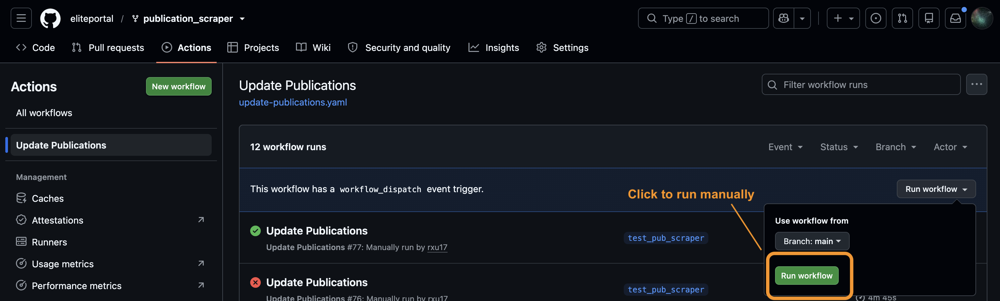

# porTools

Sage portals require content management of publications, people, data, studies and grants stored in Synapse. This package helps maintain that content with constrained formatting.

[[[[work in-progress]]]]

`devtools::install_github('Sage-Bionetworks/porTools')`

## Table of Contents

* [Installation instructions](#installation-instructions)
* [Usage](#usage)
  * [Run Locally](#run-locally)
  * [Run Manually with GitHub Actions](#run-manually-with-github-actions)
* [Automation](#automation)
* [Updates](#updates)
* [Troubleshooting](#troubleshooting)
  * [PubMed Abstract Retrieval Failures](#pubmed-abstract-retrieval-failures)
  * [Publications Folder / File View Not Updated](#publications-folder--file-view-not-updated)
  * [Synapse Authentication Failure](#synapse-authentication-failure)
  * [Workflow Stalling](#workflow-stalling)

## Installation instructions

These are the instructions for installing the dependencies for this project. You will need to have R and RStudio installed on your computer. You will also need to have an account on Synapse.

```R
install.packages('remotes')
remotes::install_cran('rentrez')
remotes::install_cran('librarian')
remotes::install_version('rjson', version='0.2.21')
remotes::install_version('reticulate', version='1.28')
reticulate::install_miniconda()
remotes::install_cran("synapser", repos = c("http://ran.synapse.org", "https://cloud.r-project.org"))
```

## Usage

The publication update can be run either locally from the command line or manually through GitHub Actions.

### Run Locally

Run the script from the command line:

```bash
Rscript ./inst/scripts/query-pubmed-grants.R \
    --grant_table syn51209786 \
    --parent syn51317180 \
    --pub_table syn51407023
```

### Run Manually with GitHub Actions

The [`updated-publications.yaml`](.github/workflows/updated-publications.yaml) workflow supports `workflow_dispatch`, allowing it to be run manually from the GitHub Actions tab.

To manually run the workflow:

1. Open the [Actions tab](https://github.com/eliteportal/publication_scraper/actions).
2. Select the [Update Publications workflow](https://github.com/eliteportal/publication_scraper/actions/workflows/update-publications.yaml).
3. Select **Run workflow**.



This is also the recommended way to re-run the publication update after resolving a workflow failure.

## Automation

The [`updated-publications.yaml`](.github/workflows/updated-publications.yaml) GitHub Actions workflow runs the publication update automatically on a monthly schedule. The workflow runs the same publication query described above using the Synapse service user `synapse-service-dpe-team`.

Important notes about the GitHub Action:

* GitHub automatically disables scheduled workflows in public repositories after 60 days of repository inactivity. See [Publications Folder / File View Not Updated](#publications-folder--file-view-not-updated) for troubleshooting.
* Review the **Query PubMed and upload results** step in the Actions run to determine whether publications were updated. If there are no new PMIDs to add, the output will include `[1] "All pmids already in the portal"`.

## Updates

**2023-10-10**

* If the grant serial number overlaps with another, for example `UH2AG064706` and `UH3AG064706`, then a different call to get the search results must be made and the previously developed functions do not work.
* Found the NIH library for R is much faster than Python.

## Troubleshooting

### PubMed Abstract Retrieval Failures

When retrieving abstracts by PubMed ID using the `get_abstract` function, you may occasionally encounter an `HTTP failure: 404` error. If the same request succeeds when retried without any changes, the error may be caused by a transient issue with the NCBI service or HTTP request.

The `get_abstract` function includes retry logic to handle temporary request failures. However, the retry interval may not always be long enough for the issue to resolve. If the request continues to fail after all retry attempts, wait a few minutes and [manually run the workflow](#run-manually-with-github-actions).

### Publications Folder / File View Not Updated

If the publications folder and subsequent file view monitoring have not been updated as expected, check whether the scheduled workflow is still enabled.

GitHub automatically disables scheduled workflows in public repositories after 60 days of repository inactivity. Check the [Actions tab](https://github.com/eliteportal/publication_scraper/actions) to confirm that the [`updated-publications.yaml` workflow](https://github.com/eliteportal/publication_scraper/actions/workflows/update-publications.yaml) is enabled.

If it has been disabled (there will be a note specifying it has been disabled with an option to enable), manually re-enable it and then [run the workflow](#run-manually-with-github-actions).

### Synapse Authentication Failure

If the workflow fails with the following error:

```text
Error: synapseclient.core.exceptions.SynapseAuthenticationError:
You are not logged in and do not have access to a requested resource
```

the `SYNAPSE_PAT` GitHub secret may have expired, been revoked, or otherwise become invalid.

The workflow authenticates to Synapse using a Personal Access Token (PAT) associated with the DPE Synapse service user. If the token is no longer valid (there is a 180-day inactivity expiration policy with Synapse PATs), log in to Synapse using the DPE service user account and create a new [Personal Access Token](https://docs.synapse.org/synapse-docs/managing-your-account#Personal-Access-Tokens-(PATs)).

After creating the new token:

1. Update the repository's `SYNAPSE_PAT` [GitHub Actions repository secret](https://github.com/eliteportal/publication_scraper/settings/secrets/actions) with the new token.
2. Manually run the workflow using [GitHub Actions](#run-manually-with-github-actions).
3. Confirm that the workflow can successfully authenticate to Synapse and complete the publication update.

### Workflow Stalling

If the workflow appears to stall without producing additional output , check the Actions logs to determine the last step or message that completed.

The workflow may occasionally appear to stall while communicating with an external service, particularly during:

* Synapse authentication (`syn$login()`)
* PubMed metadata retrieval (`pub_query()`)

If the workflow stalls during Synapse login, would cancel the stalled workflow, wait a few minutes, and then [manually run the workflow again](#run-manually-with-github-actions).

If the workflow stalls during retrieving the publications externally (e.g: `pub_query()`), the issue may be related to a temporary PubMed/NCBI service or network issue. You could continued to wait (it may take up to 30 minutes or longer) or cancel the stalled workflow, wait a few minutes, and then [manually run the workflow again](#run-manually-with-github-actions).
